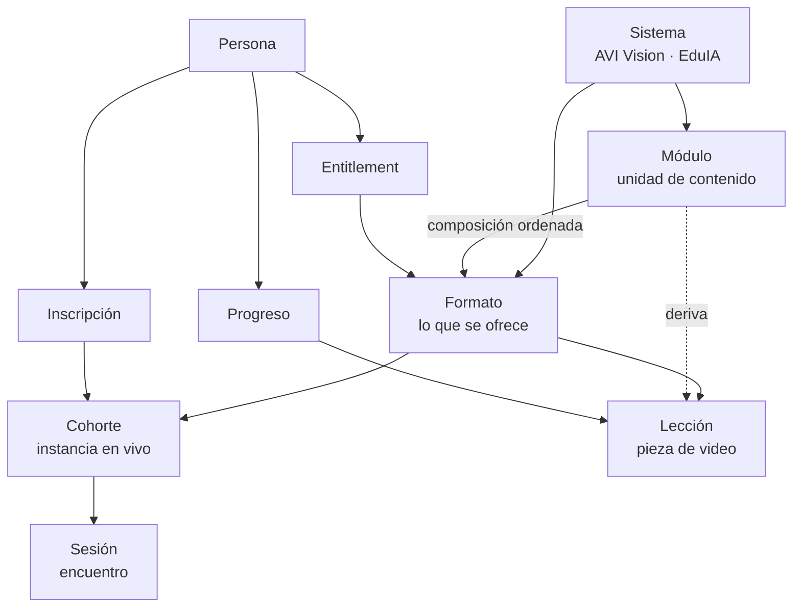

# Arquitectura objetivo — AVI

Documento de referencia para decidir y para orientar a cualquier agente que trabaje en este
repositorio. Describe el estado verificado, el modelo al que queremos llegar y el orden para
llegar. No describe funcionalidad implementada: lo que ya existe está en
`docs/PLATFORM_ARCHITECTURE.md` y `docs/SELF_PACED_ARCHITECTURE.md`.

- Fecha: 2026-08-19
- Estado: propuesta, pendiente de aprobación
- Alcance: modelo de contenido, superficies, frontera de seguridad, capa comercial y operación

## 0. Alcance de esta etapa

AVI son tres áreas: **Formación**, **Investigación y laboratorio**, y **Desarrollo y producción**.
Las tres están presentes en la comunicación pública y las tres caben en el modelo de dominio —
una implementación para una productora es un formato `a_medida`; un sistema licenciado es un
formato `licencia`; el laboratorio conserva su área propia (`lab.json`, `id-lab`).

**La operación de esta etapa es Formación**: venta de cursos, gestión y aula virtual, apuntadas al
**próximo taller**, no al que terminó. La cohorte de agosto 2026 queda cerrada como está: no se
reabren accesos ni materiales. Las otras dos áreas se comunican y se atienden por consulta, sin
construcción operativa por ahora.

---

## 1. El problema de fondo

**Hoy no está separado qué se enseña de cómo se entrega.** Cada formato nuevo obliga a
reescribir el contenido, porque el temario vive dentro del producto comercial.

La consecuencia se ve en los datos: Visión AI está modelado cuatro veces, con cuatro nociones
de "módulo" y sin un identificador en común.

| Archivo | Qué llama módulo | Identificadores |
|---|---|---|
| `data/vision-ai.json` | las 3 clases dictadas | `clase-01…03` |
| `data/vision-ai-paths.json` | 4 piezas combinables con horas | `vision-1`, `vision-2p`, `vision-2i`, `intensivo-6` |
| `data/vision-ai-autoguiado.json` | 3 bloques editoriales, 9 lecciones | `sp-m01…03` |
| `data/capacitaciones.json` | 7 productos comerciales | `vision-ai-modulo-1`, … |

`data/vision-ai-cohort-2026-08.json` agrega una quinta noción: las sesiones de una cohorte.

El caso más claro está en el catálogo público. El temario del **Intensivo integral de 12 h** dice
literalmente:

```
· Intensivo · Producción
· Intensivo · Creatividad
· Integración y cierre
```

La composición existe como texto, no como dato. Quien abre esa ficha no ve qué contiene, y editar
el temario de Producción no actualiza el integral.

Esto es exactamente lo que bloquea el objetivo declarado: que AVI Vision pueda ser hoy una
capacitación, mañana una versión autoguiada, después una implementación y más adelante un sistema
licenciado, sin reconstruir la plataforma.

---

## 2. Modelo de dominio objetivo

**Principio: el contenido se define una sola vez; el formato dice cómo se entrega.**



### Entidades

| Entidad | Qué es | Campos mínimos |
|---|---|---|
| `sistemas` | la familia formativa | `id`, `slug`, `titulo`, `resumen` |
| `modulos` | **unidad de contenido reutilizable** | `id`, `sistema_id`, `titulo`, `horas`, `temario`, `objetivos`, `resultado`, `requisitos`, `estado` |
| `formatos` | lo que se ofrece y se cotiza | `id`, `slug`, `sistema_id`, `modo`, `modulo_ids[]`, `publico`, `estado_comercial`, `precio` |
| `cohortes` | instancia en vivo de un formato | `id`, `formato_id`, `etiqueta`, `zona_horaria`, `estado` |
| `sesiones` | encuentro de una cohorte | `id`, `cohorte_id`, `orden`, `inicio_utc`, `duracion`, `estado` |
| `lecciones` | pieza de video de un formato autoguiado | `id`, `formato_id`, `modulo_id`, `orden`, `titulo`, `duracion`, `estado_editorial` |
| `inscripciones` | persona ↔ cohorte | `persona_id`, `cohorte_id`, `rol`, `estado` |
| `entitlements` | persona ↔ formato | `persona_id`, `formato_id`, `estado`, `otorgado_en`, `vence_en` |
| `progreso` | persona ↔ lección | `persona_id`, `leccion_id`, `posicion`, `completado_en` |

`modo` de un formato: `en_vivo`, `practico`, `intensivo`, `autoguiado`, `a_medida`, `licencia`.
Por regla comercial, `intensivo` y la palabra "Intensivo" quedan reservados al taller de 12 horas;
los prácticos de 6 horas se llaman "Práctico".

### Invariantes

1. Un temario se escribe **una sola vez**, en `modulos`. Los formatos lo componen por referencia.
2. Un formato nunca contiene texto de contenido propio: solo la composición, el encuadre comercial
   y su estado.
3. Los identificadores son estables y no se reciclan. Un `slug` público no cambia sin redirección.
4. Todo lo que vive en `data/*.json` es público. Los datos de personas nunca están ahí.
5. Un estado comercial (`borrador`, `disponible`, `en_desarrollo`, `discontinuado`) es un dato, no
   una decisión de código: ninguna superficie decide sola si algo se puede comprar.

### Qué resuelve

- El Intensivo integral pasa a declarar `modulo_ids: [produccion, creatividad, integracion]` y su
  ficha muestra el temario real, siempre sincronizado.
- El autoguiado deja de ser código nuevo: es un formato `modo: autoguiado` sobre los mismos módulos.
- El configurador modular ya escrito (`assets/path-builder.js`, hoy huérfano) encuentra su fuente
  natural en `modulos` y deja de necesitar un archivo propio.
- Una implementación para una productora o una licencia son dos formatos más, sin superficie nueva.

### Migración desde lo actual

| Hoy | Destino |
|---|---|
| `capacitaciones.json` → `sistemas` | `sistemas` (ya tiene la forma correcta) |
| `capacitaciones.json` → `capacitaciones[]` | se parte en `formatos` + `modulos` |
| `vision-ai-paths.json` → `modules[]` | absorbido por `modulos` (es el modelo más cercano) |
| `vision-ai-paths.json` → `presets[]` | `formatos` con `modo: intensivo` |
| `vision-ai.json` | absorbido por `modulos` + un `formato` en vivo |
| `vision-ai-autoguiado.json` → `modules/lessons` | `formato` autoguiado + `lecciones` |
| `vision-ai-cohort-2026-08.json` | `cohortes` + `sesiones` |
| `lab.json` | queda aparte: no es formación |

---

## 3. Superficies

### Públicas

| Ruta | Rol | Estado |
|---|---|---|
| `index.html` | marca y puerta de entrada | **placeholder de una pantalla** desde 2026-08-19 |
| `talleres.html` | catálogo de formación | vive, sin enlazar desde la portada |
| `taller.html?slug=` | ficha de un formato | vive |
| `avi-vision.html` | el sistema y sus puntos de entrada | vive |
| `curso-vision-ai.html` | el autoguiado y su lista de espera | **a construir** |
| `quienes-somos.html` | trayectoria y equipo | a migrar al sistema visual nuevo |

### Privadas

| Ruta | Rol |
|---|---|
| `login.html`, `cambiar-clave.html`, `logout.html` | identidad |
| `aula.html` | cohorte, sesiones y materiales autorizados |
| `mi-curso.html` | campus del autoguiado, **a construir** |
| `plataforma.html` | superficie interna del equipo |

### A retirar

`capacitaciones.html`, `contenidos.html`, `clientes.html`, `id-lab.html`, `modos.html` y
`clase-abierta.html` pertenecen al sistema anterior: usan `assets/styles.css`,
`assets/platform.js` y `assets/navigation.js`, hoy están todas detrás del gate y ninguna se enlaza
desde la portada nueva. Retirarlas elimina un sistema visual completo y unos 35 MB de video que
solo ellas usan. Requiere inventario previo, decidido el 2026-08-19.

---

## 4. Frontera de seguridad

Conviven dos cosas que no hay que confundir.

**Interfaz.** `assets/gate.js` oculta el contenido y ofrece la pantalla de acceso. GitHub Pages ya
entregó el archivo antes de que corra el JavaScript, así que cualquiera puede leer el HTML de una
página "protegida". Esto es orientación, no protección.

**Servidor.** Las reglas de Firestore y los permisos de Google Drive sí protegen. Son la única
frontera real que existe hoy.

### Reglas invariantes

1. **Toda página nueva nace pública.** Si algo no puede ser público, no va en el HTML ni en
   `data/*.json`: va detrás de una regla de servidor.
2. Nombres, correos, evaluaciones, entregas y enlaces privados nunca viajan en contenido estático.
3. La cookie `avi_auth=ok` no es autorización.
4. El servidor obtiene la identidad del token verificado, nunca del cuerpo de la solicitud.
5. Las grabaciones usan URL firmadas o almacenamiento con reglas, no rutas públicas.

### Deuda abierta

El cierre a preview privado del 2026-08-19 restringió `class_materials` a tres cuentas por email y
dejó `students/{uid}` con `allow read: if false`: el claim `student` permite entrar al aula pero
no abre ningún material. Decisión del 2026-08-19: **no se corrige para la cohorte de agosto**, que
queda cerrada. Las reglas se rediseñan una sola vez, contra el modelo de roles y para el próximo
taller, sin arrastrar la lista de emails del preview.

---

## 5. Capa comercial

No existe todavía. El orden propuesto, de menor a mayor compromiso:

1. **Consultas registradas.** El formulario escribe en Firestore con reglas de solo creación,
   además de seguir ofreciendo el envío por correo. Sin esto, cada consulta que no completa el
   paso del correo se pierde sin dejar rastro.
2. **Lista de espera.** Registro de interés por formato, sin fechas ni precios. Construye la lista
   de a quién avisar cuando se abra la próxima edición.
3. **Inscripción a cohorte.** Fecha, cupo y confirmación. Requiere fijar calendario.
4. **Compra y entitlement.** Proveedor de pago, webhook verificado contra un backend, entitlement
   concedido del lado del servidor y token corto de reproducción para el video. Ninguna parte de
   esto puede vivir en el navegador.

Los pasos 1 y 2 no requieren cambiar de plan de Firebase. El paso 4 sí requiere backend real.

---

## 6. Operación y publicación

**Hoy.** El alta de alumnos, los roles y la subida de materiales se hacen con scripts locales en
`functions/scripts/` que necesitan una clave de servicio. Funciona, pero depende de una máquina.

**Objetivo.** Panel docente con las mismas operaciones detrás de roles explícitos y traza mínima
de auditoría.

**Publicación.** `push` a `main` publica. No hay entorno de prueba ni validación automática. El
validador `scripts/validate-site.mjs` existe desde el 2026-08-19 pero nada lo ejecuta solo.

Pendiente: integración continua que corra el validador en cada push, y un entorno de vista previa
para no ensayar sobre producción.

---

## 7. Fases

Ordenadas por el ciclo del próximo taller: comunicar → vender → gestionar → dictar.

| Fase | Qué incluye | Criterio de salida |
|---|---|---|
| **A · Unificar** | Modelo `modulos` + `formatos`, migración de los cinco archivos, catálogo y fichas leyendo del modelo nuevo | Un temario se edita en un solo lugar y se refleja en todas las fichas |
| **B · Comunicar** | Sitio completo de vuelta sobre el modelo nuevo: portada, catálogo, `avi-vision`, autoguiado, `quienes-somos`; retiro del sitio heredado; fin del placeholder | El sitio se relanza con un solo sistema visual y las tres áreas presentadas |
| **C · Vender** | Consultas registradas, lista de espera por formato, y cuando haya calendario, inscripción a la próxima cohorte | Una consulta o inscripción queda registrada sin depender del cliente de correo |
| **D · Aula** | Reglas de Firestore por rol diseñadas de cero, aula apuntada a la cohorte nueva, materiales y roles del próximo taller | Un alumno de la próxima cohorte entra y abre sus materiales el día uno |
| **E · Operar** | Panel docente, integración continua, entorno de vista previa | Publicar y administrar deja de requerir la máquina de Federico |

A es la base de todo. B y C dependen de A y pueden solaparse. D se construye contra la fecha del
próximo taller. E es transversal y puede empezar cuando convenga.

---

## 8. Decisiones tomadas

Registradas el 2026-08-19:

- Copia de trabajo canónica y única: `/Users/aimac/Fede/Proyectos/avi/_repos/web`.
- Identidad Git: `Federico Berón / fede@audiovisualintelligence.ai`.
- Del commit `5852fe8` se reconstruyen `curso-vision-ai.html` y `mi-curso.html`; `academia.html` y
  `programa.html` se descartan por duplicar `talleres.html` y `taller.html`.
- Indexación: portada, `talleres.html` y `avi-vision.html` cuando se lance; las fichas quedan fuera
  hasta aprobar su contenido final. Mientras el sitio esté en placeholder, todo cerrado.
- Las consultas se guardan en Firestore sin cambiar de plan.
- La acción para un interesado es lista de espera, sin publicar fechas ni precios.
- `quienes-somos.html` se migra; las otras seis páginas heredadas requieren inventario previo.
- La portada queda como una sola pantalla hasta terminar el sitio.
- La cohorte de agosto 2026 queda cerrada: no se reabren accesos ni materiales. La plataforma se
  construye para el próximo taller.
- La operación de esta etapa es Formación (venta, gestión, aula). Investigación/Lab y
  Desarrollo/Producción se comunican y se atienden por consulta.

## 9. Decisiones pendientes

1. **Backend real o estático con Firebase detrás.** Condiciona compra, entitlement y panel. Existe
   un prototipo Next.js en `private-platform-preview/`, sin remoto configurado.
2. **Alcance del retiro del sitio heredado**, tras el inventario.
3. **Calendario de la próxima cohorte**, que habilita la fase de inscripción.
4. **Si `AGENTS.md`, `CLAUDE.md` y `docs/VISION_AI_WORKSHOP_CONTEXT.md` se versionan.** Hoy solo
   existen en disco; versionarlas las vuelve públicas, y la última contiene rutas del vault.
